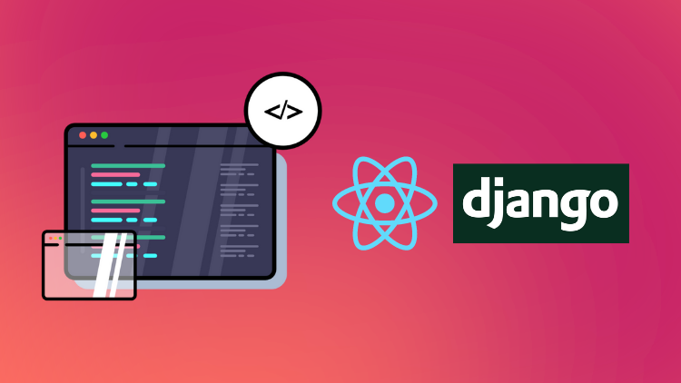

# django-react-tasks-manager

Source code for a Udemy course [Full Stack Web Development with React, MUI, Django, and DRF](https://www.udemy.com/course/full-stack-web-development-with-react-mui-django-and-drf/?couponCode=DJRTPROMO)

 
